# PetIntelHQ

PetIntelHQ is an iOS application I'm building with SwiftUI to help pet owners keep everything about their pets organized in one place.

After spending years working in veterinary medicine, I saw firsthand how difficult it can be to keep track of medical records, medications, vaccinations, appointment history, travel paperwork, and emergency information. PetIntelHQ is my attempt to solve that problem by giving pet owners one simple place to manage everything related to their pets.

This project combines my veterinary background with my passion for software development and serves as my primary iOS portfolio project while I continue learning and expanding my iOS development skills.

## Features

- Create pet profiles
- Guided onboarding experience
- Store pet information
- Track medications
- Store allergy information
- Save microchip details
- Record birthday or estimated age
- Upload pet photos
- Store food and nutrition information
- Save favorite toys and treats
- Built entirely with SwiftUI

## Built With

- Swift
- SwiftUI
- Xcode
- MVVM Principles
- Git
- GitHub

## Application Screens

### Welcome

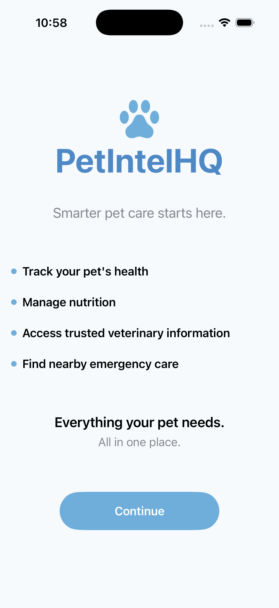

### Pet Name

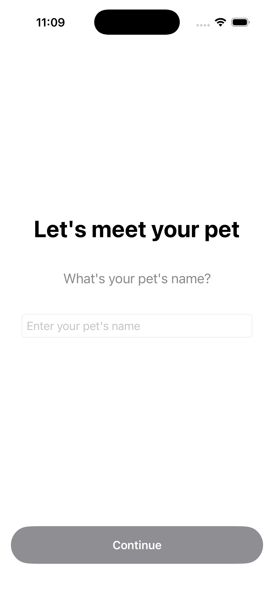

### Species

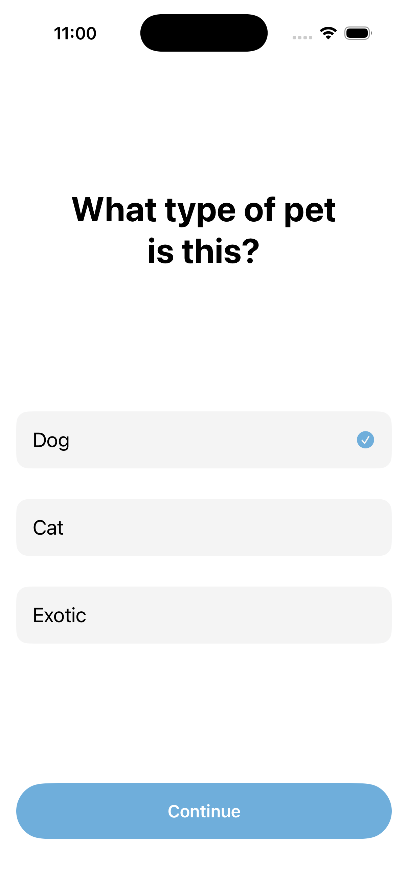

### Breed

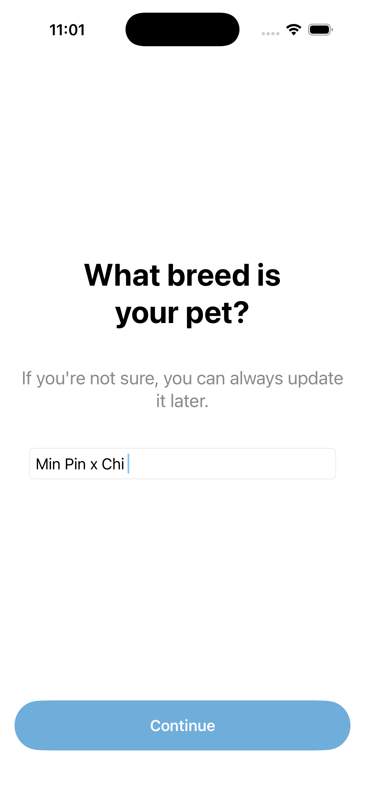

### Birthday

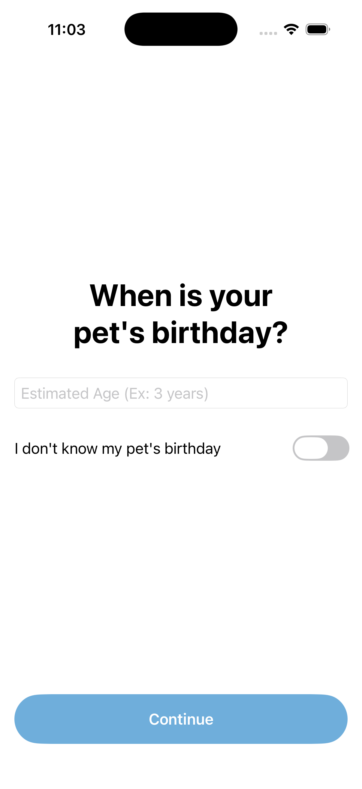

### Upload Photo

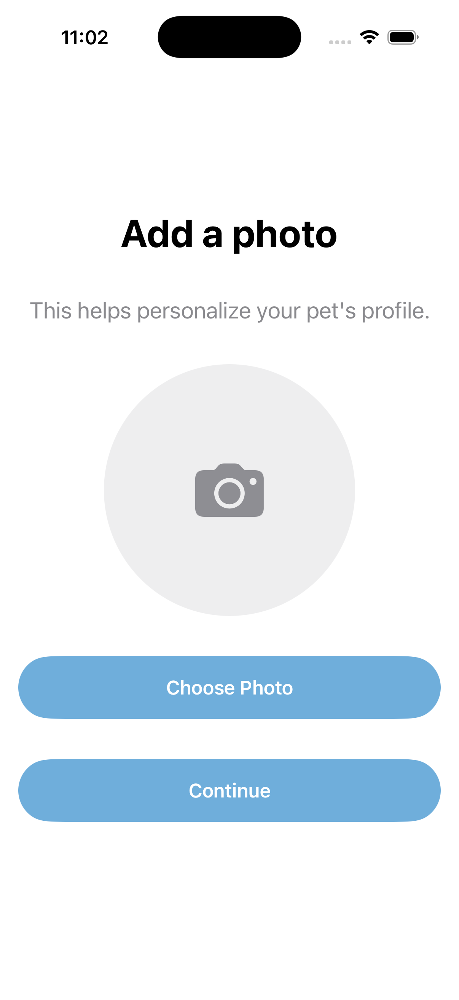

### Microchip Information

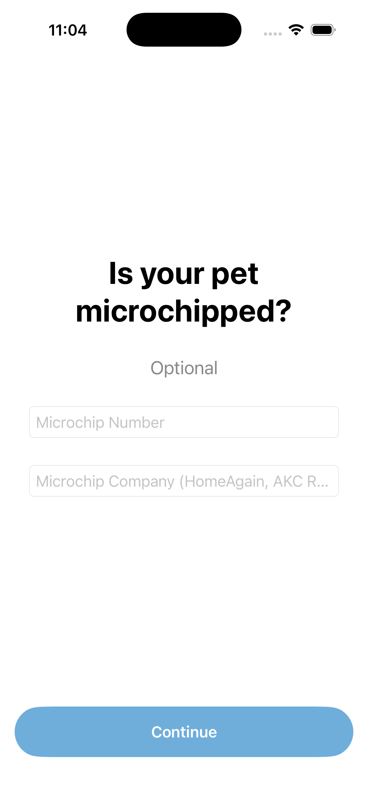

### Medications

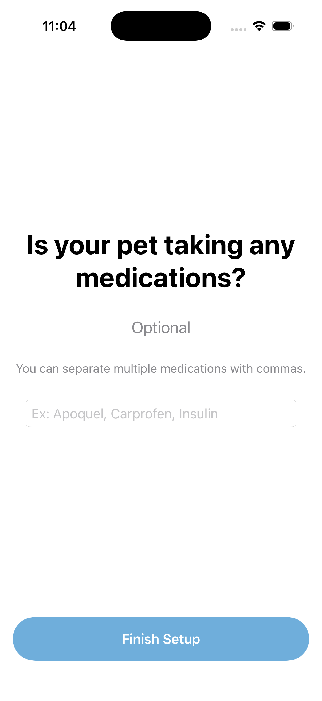

### Food Information

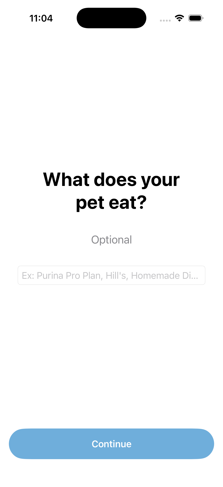

### Allergies

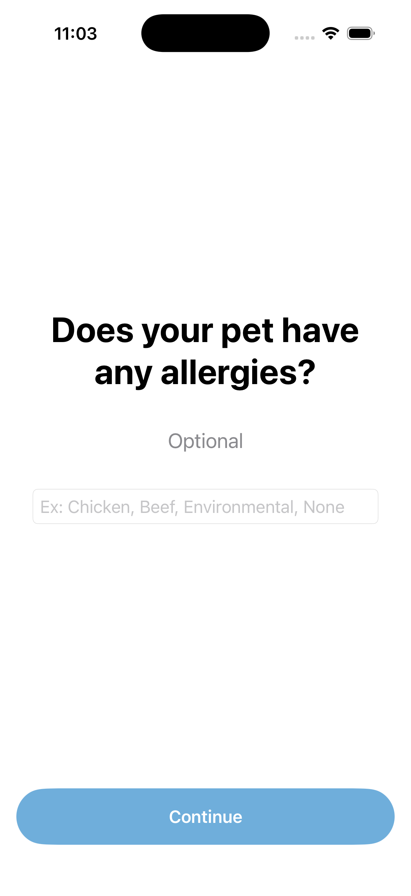

### Favorite Toy or Treat

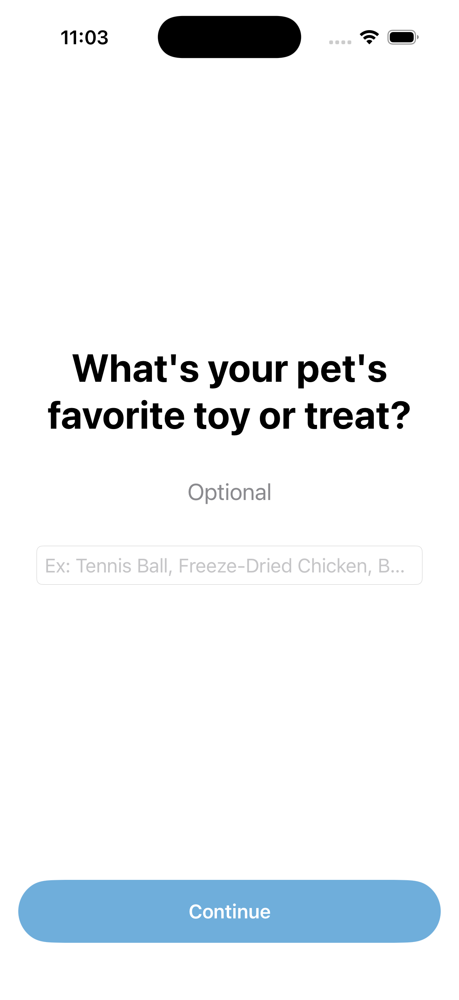

## Live Demo

A simulator walkthrough of the onboarding experience is included in this repository.

Location:

```
PetIntelHQ/Live Demo/appsim.mov
```

You can also download the video directly from GitHub and watch the onboarding flow from start to finish.

## Skills Demonstrated

- SwiftUI User Interface Design
- State Management
- NavigationStack
- Forms and User Input
- Image Picker Integration
- Data Modeling
- Mobile UX Design
- Git Version Control
- GitHub Repository Management
- iOS Application Architecture

## Roadmap

Upcoming features include:

- Vaccination tracking
- Medical history timeline
- Appointment reminders
- Veterinary visit history
- Medication reminders
- Emergency contacts
- USDA travel document storage
- Health certificate management
- Cloud synchronization
- User authentication
- Multiple pet support
- Apple Watch support

## Why I Built This

As a veterinary professional for nearly ten years, I constantly watched pet owners struggle to remember medications, vaccine dates, microchip numbers, diets, allergies, and important medical history.

Building software that solves real problems is what excites me most, and PetIntelHQ allows me to combine my healthcare experience with software engineering to create something that could genuinely improve the lives of pet owners.

## About Me

I'm a recent Computer Science graduate with a background in veterinary medicine who enjoys building software that solves practical problems.

My interests include iOS development, cloud computing, DevOps, and software engineering. I enjoy creating applications that bridge technology with real-world industries, especially veterinary medicine.

I'm actively expanding PetIntelHQ while building additional Swift and cloud-based projects as I continue growing as a software engineer.
